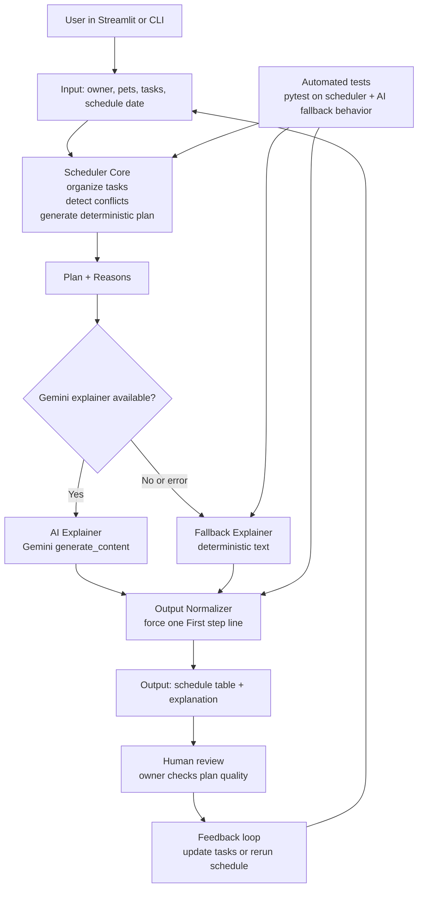

# PawPal+ System Architecture

This diagram shows how task data moves through the scheduler, where AI explanation is generated, and where human/testing validation happens.

Mermaid (for markdown renderers):



Mermaid.live paste version (paste only these lines, without code fences):

```text
flowchart TD
    U[User in Streamlit or CLI] --> I[Input: owner, pets, tasks, schedule date]
    I --> S[Scheduler Core<br/>organize tasks<br/>detect conflicts<br/>generate deterministic plan]

    S --> P[Plan + Reasons]
    P --> G{Gemini explainer available?}

    G -->|Yes| A[AI Explainer<br/>Gemini generate_content]
    G -->|No or error| F[Fallback Explainer<br/>deterministic text]

    A --> N[Output Normalizer<br/>force one First step line]
    F --> N

    N --> O[Output: schedule table + explanation]
    O --> H[Human review<br/>owner checks plan quality]

    T[Automated tests<br/>pytest on scheduler + AI fallback behavior] --> S
    T --> F
    T --> N

    H --> R[Feedback loop<br/>update tasks or rerun schedule]
    R --> I
```

Plain text fallback diagram:

Input/User -> Scheduler Core -> Plan + Reasons -> Gemini available?
Gemini available? (Yes) -> AI Explainer -> Output Normalizer -> Output -> Human Review -> Feedback Loop -> Input/User
Gemini available? (No/Error) -> Fallback Explainer -> Output Normalizer -> Output -> Human Review -> Feedback Loop -> Input/User
Automated tests -> Scheduler Core
Automated tests -> Fallback Explainer
Automated tests -> Output Normalizer

## Main Components

- Input layer: captures owner profile, pets, tasks, and selected date.
- Scheduler core: builds ordered plan and conflict warnings using deterministic logic.
- AI explainer: uses Gemini to produce natural-language explanation from plan data.
- Fallback explainer: returns deterministic explanation when AI is unavailable or fails.
- Output normalizer: ensures one clear first-action recommendation.
- Human review: user validates explanation and adjusts plan inputs if needed.
- Test layer: verifies scheduler behavior and AI/fallback reliability.

## Data Flow

1. User enters task data.
2. Scheduler generates plan and reasons.
3. System attempts AI explanation.
4. On AI failure or missing key, fallback explanation is used.
5. Output is normalized and shown to user.
6. User reviews and iterates.

## Human and Testing Involvement

- Human in the loop: the owner checks whether the plan and explanation make sense before acting.
- Reliability/testing in the loop: pytest validates deterministic scheduling, fallback behavior, and explanation pipeline safety.
